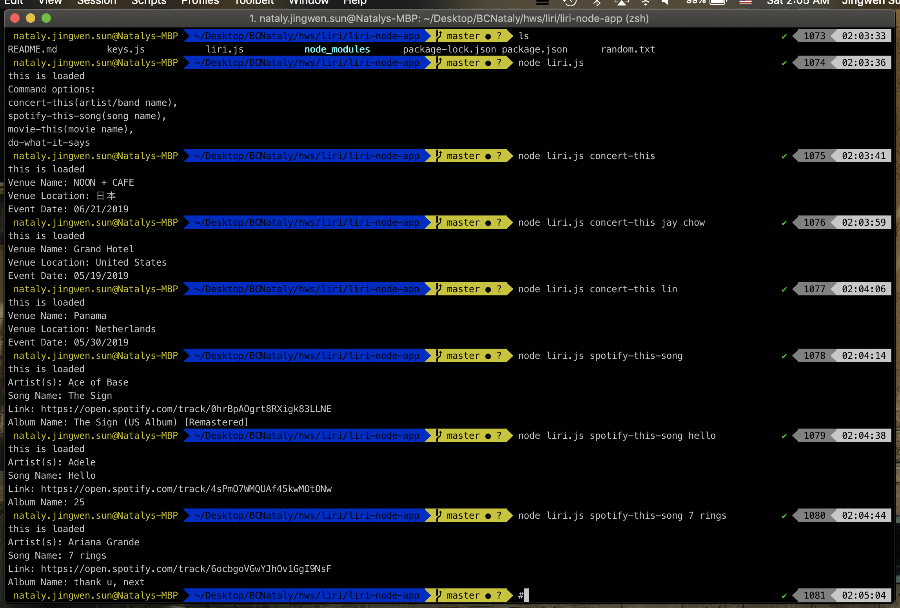

# liri-node-app
homework week 10

# LIRI Bot
* LIRI is a _Language_ Interpretation and Recognition Interface. LIRI will be a command line node app that takes in parameters and gives you back data.

* LIRI will search Spotify for songs, Bands in Town for concerts, and OMDB for movies.

* Use commands:
1. `node liri.js concert-this '<artist/band name here>'`
* This will search the Bands in Town Artist Events API for an artist and render the following information about each event to the terminal:
* Name of the venue
* Venue location
* Date of the Event (use moment to format this as "MM/DD/YYYY").

2. `node liri.js spotify-this-song '<song name here>'`
* This will retrieve song information from the Spotify API & show the following information about the song in your terminal/bash window
* Artist(s)
* The song's name
* A preview link of the song from Spotify
* The album that the song is from
    * * If no song is provided then  will default to "The Sign" by Ace of Base.

3. `node liri.js movie-this '<movie name here>'`
* This will search the OMDB API for an artist and render the following information about each movie to the terminal:
* Title of the movie. 
* Year the movie came out.
* IMDB Rating of the movie.
* Rotten Tomatoes Rating of the movie.
* Country where the movie was produced.
* Language of the movie.
* Plot of the movie.
* Actors in the movie.
    * * If the user doesn't type a movie in, the program will output data for the movie 'Mr. Nobody'.
    
4. `node liri.js do-what-it-says`
* It should run `spotify-this-song` for "I Want it That Way," as follows the text in `random.txt`.

JavaScript, NodeJS, 
APIs: Node-Spotify-API, OMDB API, Bands In Town API,
NPMs: Axios, DotEnv, Moment,

* * * * The Spotify API requires you sign up as a developer to generate the necessary credentials. You can follow these steps in order to generate a **client id** and **client secret**:
* Step One: Visit <https://developer.spotify.com/my-applications/#!/>
* Step Two: Either login to your existing Spotify account or create a new one (a free account is fine) and log in.
* Step Three: Once logged in, navigate to <https://developer.spotify.com/my-applications/#!/applications/create> to register a new application to be used with the Spotify API. You can fill in whatever you'd like for these fields. When finished, click the "complete" button.
* Step Four: On the next screen, scroll down to where you see your client id and client secret. Copy these values down somewhere, you'll need them to use the Spotify API and the [node-spotify-api package](https://www.npmjs.com/package/node-spotify-api).

  
